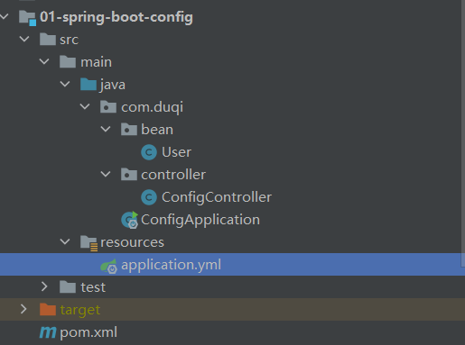

spring-boot基本配置

SpringBoot是一个轻量级、无侵入式框架，通过内嵌Tomcat容器，从来可以快速得构建应用。与Spring相比，简化了配置，无需代码生成，提供生产就绪功能，例如指标、运行状况检查和外部化配置

版本说明

```
springboot: 2.4.10
```

项目构建

```
IDEA－＞New -> Project ->Maven -> 01-spring-boot-config
```

项目结构



pom文件引入依赖

```
<dependencies>
    <!--SpringBoot-->
    <dependency>
        <groupId>org.springframework.boot</groupId>
        <artifactId>spring-boot-starter-web</artifactId>
    </dependency>

    <!--lombok插件-->
    <dependency>
        <groupId>org.projectlombok</groupId>
        <artifactId>lombok</artifactId>
        <optional>true</optional>
    </dependency>
</dependencies>
```

application.yml配置

```
server:
  port: 8080

# SpringBoot配置
spring:
  application:
    name: @project.artifactId@

# 自定义配置，按照yml格式编写即可
userinfo:
  id: 1
  username: zhangsan
```

完成配置之后可以写代码进行测试，首先SpringBoot启动类

```
@SpringBootApplication
public class ConfigApplication {
    public static void main(String[] args) {
        SpringApplication.run(ConfigApplication.class, args);
    }
}
```

@SpringBootApplication注解式SpringBoot中最重要得注解之一，其目的是开启自动配置。它是一个复合注解，由以下组成：

```
@Target({ElementType.TYPE})
@Retention(RetentionPolicy.RUNTIME)
@Documented
@Inherited
@SpringBootConfiguration
@EnableAutoConfiguration
@ComponentScan
```

注解的含义及作用，可以参考：``https://blog.csdn.net/qq_28289405/article/details/81302498``

接口Controller层

```
@Slf4j
@RestController
@RequiredArgsConstructor
public class ConfigController {
    private final User user;
    @GetMapping("/getUserInfo")
    public String getUserInfo() {
        return "id:"+user.getId()+"  name:"+user.getUsername();
    }
}
```

bean配置对象

```
@Data
@Component
public class User {
    @Value("${userinfo.id}")
    private int id;

    @Value("${userinfo.username}")
    private String username;
}
```

@Component：该注解修饰类，在Spring进行bao扫描的时候，会将这个类作为bean加载进Spring容器，在其他地方使用时，只需要将其注入，即该类的生命周期由Spring容器管理

@Value：通过SpEl表达式来给属性赋值，一般有两种写法：

方式一：@Value("#{}")

```
@Value("#{'zhangsan'}")
private String name;
表示将 zhangsan 赋值给变量  name
```

方式二：@Value("${}")

```
@Value("#{userinfo.id}")
private int id;
表示将 读取配置文件中 userinfo.id的值  赋值给  id
```

接口测试

请求：``http://127.0.0.1:8080/getUserInfo``

响应：``id:1 name:zhangsan``

至此，SpringBoot入门级配置完成，如果需要了解更多，请访问官网：``https://spring.io/projects/spring-boot/``

本示例完整地址：``https://github.com/denyong/spring-boot-all.git``