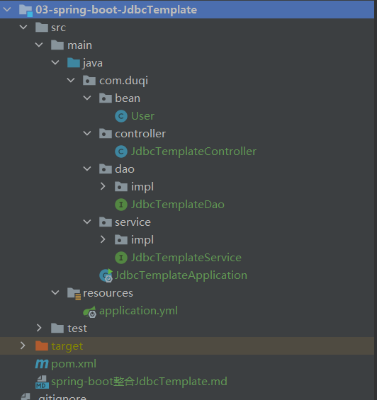

# spring-boot整合JdbcTemplate

版本说明

```
springboot: 2.4.10

mysql: 8.0.12

JdbcTemplate:2.4.10
```

Jdbc与JdbcTemplate的区别

```
Jdbc是一种用于执行SQL语句的Java API，可以为多种关系数据库提供统一的访问，简单的说就是用Java代码去操作数据库。

JdbcTemplate是Spring对Jdbc的封装增强，避免了直接通过jdbc来操作数据库的繁琐代码。
```

项目构建

```
IDEA－＞New -> Project ->Maven -> 03-spring-boot-JdbcTemplate
```

项目结构




pom文件引入依赖

```xml
<dependencies>
    <!--SpringBoot-->
    <dependency>
        <groupId>org.springframework.boot</groupId>
        <artifactId>spring-boot-starter-web</artifactId>
    </dependency>
    <!-- Spring-Boot-JDBC -->
    <dependency>
        <groupId>org.springframework.boot</groupId>
        <artifactId>spring-boot-starter-jdbc</artifactId>
    </dependency>
    <!--Mysql连接驱动-->
    <dependency>
        <groupId>mysql</groupId>
        <artifactId>mysql-connector-java</artifactId>
        <version>${mysql.version}</version>
    </dependency>
    <!--druid连接池-->
    <dependency>
        <groupId>com.alibaba</groupId>
        <artifactId>druid-spring-boot-starter</artifactId>
        <version>1.1.10</version>
    </dependency>
    <!--lombok插件-->
    <dependency>
        <groupId>org.projectlombok</groupId>
        <artifactId>lombok</artifactId>
        <optional>true</optional>
    </dependency>
    <!--阿里巴巴fastjson -->
    <dependency>
        <groupId>com.alibaba</groupId>
        <artifactId>fastjson</artifactId>
        <version>1.2.35</version>
    </dependency>
</dependencies>
```

application.yml配置

```yml
server:
  port: 8003

# SpringBoot+MySql配置
spring:
  application:
    name: @project.artifactId@
  datasource:
    platform: mysql
    type: com.alibaba.druid.pool.DruidDataSource
    druid:
      # JDBC驱动
      driver-class-name: com.mysql.cj.jdbc.Driver
      # 数据库配置
      url: jdbc:mysql://localhost:3306/spring-boot-all?useSSL=false&useUnicode=true&characterEncoding=utf-8&serverTimezone=Asia/Shanghai
      username: root
      password: 123456
      initial-size: 5
      min-idle: 5
      max-active: 20
      # 连接等待超时时间
      max-wait: 30000
      # 配置检测可以关闭的空闲连接间隔时间
      time-between-eviction-runs-millis: 60000
      # 配置连接在池中的最小生存时间
      min-evictable-idle-time-millis: 300000
      validation-query: select '1' from dual
      test-while-idle: true
      test-on-borrow: false
      test-on-return: false
      # 打开PSCache，并且指定每个连接上PSCache的大小
      pool-prepared-statements: true
      max-open-prepared-statements: 20
      max-pool-prepared-statement-per-connection-size: 20
      # 配置监控统计拦截的filters, 去掉后监控界面sql无法统计, 'wall'用于防火墙
      filters: stat,wall
      # Spring监控AOP切入点，如x.y.z.service.*,配置多个英文逗号分隔
      aop-patterns: com.springboot.servie.*


```

完成配置之后可以写代码进行测试，首先SpringBoot启动类

```java 
@SpringBootApplication
public class JdbcTemplateApplication {
    public static void main(String[] args) {
        SpringApplication.run(JdbcTemplateApplication.class, args);
    }
}
```

接口Controller层：(以查询为例)

```java 
@GetMapping("/getUserInfo")
public User getUserInfo(@RequestParam Integer id) {
    return jdbcTemplateService.getUserInfo(id);
}
```

业务Service层：(以查询为例)

```java
@Override
public User getUserInfo(Integer id) {
    return jdbcTemplateDao.getUserInfo(id);
}
```

数据操作层：(以查询为例)

```java
@Override
public User getUserInfo(Integer id) {
    String sql = "select * from user where id = ?";
    User user = jdbcTemplate.queryForObject(sql, new RowMapper<User>() {
        @Override
        public User mapRow(ResultSet resultSet, int i) throws SQLException {
            return User.builder()
                .id(resultSet.getInt(1))
                .username(resultSet.getString(2))
                .build();
        }
    }, id);
    return user;
}
```


接口测试

请求：```http://127.0.0.1:8003/getUserInfo?id=1```

响应：

```json
{
    "id": 1,
    "username": "zhangsan"
}
```

至此，spring-boot整合JdbcTemplate完成，这里是简单的入门级配置，参考博文：

```
JDBC: https://www.cnblogs.com/erbing/p/5805727.html

JdbcTemplate: https://www.cnblogs.com/xifengxiaoma/p/11046099.html
```

本示例完整地址：```https://github.com/denyong/spring-boot-all.git```
