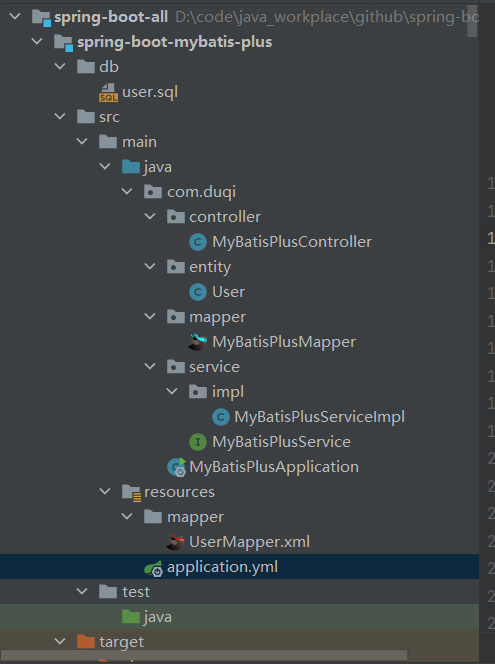

# spring-boot整合mybatis-plus

版本说明

```
springboot: 2.4.10

mysql: 8.0.12

mybatis-plus: 3.4.2
```

MyBatis与MyBatis-Plus的区别

```
MyBatis是一种数据库持久层的框架，提供mapper类与xml的映射，通过Java代码来操作数据库。

MyBatis-Plus是对MyBatis的一种增强，在不改变MyBatis原有功能上，对其增强拓展了许多功能
```


项目构建

```
IDEA－＞New -> Project ->Maven -> spring-boot-mybatis-plus
```

项目结构




pom文件引入依赖

```
<dependencies>
    <!--SpringBoot-->
    <dependency>
        <groupId>org.springframework.boot</groupId>
        <artifactId>spring-boot-starter-web</artifactId>
    </dependency>
    <!--Mysql连接驱动-->
    <dependency>
        <groupId>mysql</groupId>
        <artifactId>mysql-connector-java</artifactId>
        <version>${mysql.version}</version>
    </dependency>
    <!--druid连接池-->
    <dependency>
        <groupId>com.alibaba</groupId>
        <artifactId>druid-spring-boot-starter</artifactId>
        <version>1.1.10</version>
    </dependency>
    <!--lombok插件-->
    <dependency>
        <groupId>org.projectlombok</groupId>
        <artifactId>lombok</artifactId>
        <optional>true</optional>
    </dependency>
    <!--阿里巴巴fastjson -->
    <dependency>
        <groupId>com.alibaba</groupId>
        <artifactId>fastjson</artifactId>
        <version>1.2.35</version>
    </dependency>
    <!-- MyBatisPlus -->
    <dependency>
        <groupId>com.baomidou</groupId>
        <artifactId>mybatis-plus-boot-starter</artifactId>
        <version>3.4.2</version>
    </dependency>
</dependencies>
```

application.yml配置

```
server:
  port: 8888

# SpringBoot+MySql配置
spring:
  application:
    name: @project.artifactId@
  datasource:
    platform: mysql
    driver-class-name: com.mysql.cj.jdbc.Driver
    type: com.alibaba.druid.pool.DruidDataSource
    url: jdbc:mysql://localhost:3306/spring-boot-all?useSSL=false&useUnicode=true&characterEncoding=utf-8&serverTimezone=Asia/Shanghai
    username: root
    password: 123456

# MyBatis-Plus配置
mybatis-plus:
  configuration:
    map-underscore-to-camel-case: true
    auto-mapping-behavior: full
    log-impl: org.apache.ibatis.logging.stdout.StdOutImpl
  mapper-locations: classpath*:mapper/**/*Mapper.xml
  global-config:
    # 逻辑删除配置
    db-config:
      # 删除前
      logic-not-delete-value: 1
      # 删除后
      logic-delete-value: 0
```

完成配置之后可以写代码进行测试，首先SpringBoot启动类

```
@SpringBootApplication
public class MyBatisPlusApplication {
    public static void main(String[] args) {
        SpringApplication.run(MyBatisPlusApplication.class, args);
    }
}
```

接口Controller层

```
@RestController
@Slf4j
@RequiredArgsConstructor
public class MyBatisPlusController {
    private final MyBatisPlusService myBatisPlusService;

    @GetMapping("/getUserInfo")
    public User getUserInfo(@RequestParam Integer id) {
        log.info("id:{}", id);
        return myBatisPlusService.getUserInfo(id);
    }
}
```

业务Service层

```
@Service
@RequiredArgsConstructor
public class MyBatisPlusServiceImpl implements MyBatisPlusService {
    private final MyBatisPlusMapper myBatisPlusMapper;

    @Override
    public User getUserInfo(Integer id) {
        return myBatisPlusMapper.getUserInfo(id);
    }
}
```

数据接口Mapper层

```
@Mapper
public interface MyBatisPlusMapper {
    /**
     * 获取user
     *
     * @param id
     * @return
     */
    User getUserInfo(@Param("id") Integer id);
}
```

UserMapper.xml配置

```
<mapper namespace="com.duqi.mapper.MyBatisPlusMapper">

    <select id="getUserInfo" resultType="com.duqi.entity.User">
        select *
        from user
        where id = #{id}
    </select>
</mapper>
```

接口测试

请求：http://127.0.0.1:8888/getUserInfo?id=12

响应：{"id":12,"name":"zhnagsan"}

至此，SpringBoot整合MyBatis-Plus完成，这里是简单的入门级配置，如果需要了解更多，请访问官网：https://baomidou.com/guide/

本示例完整地址：